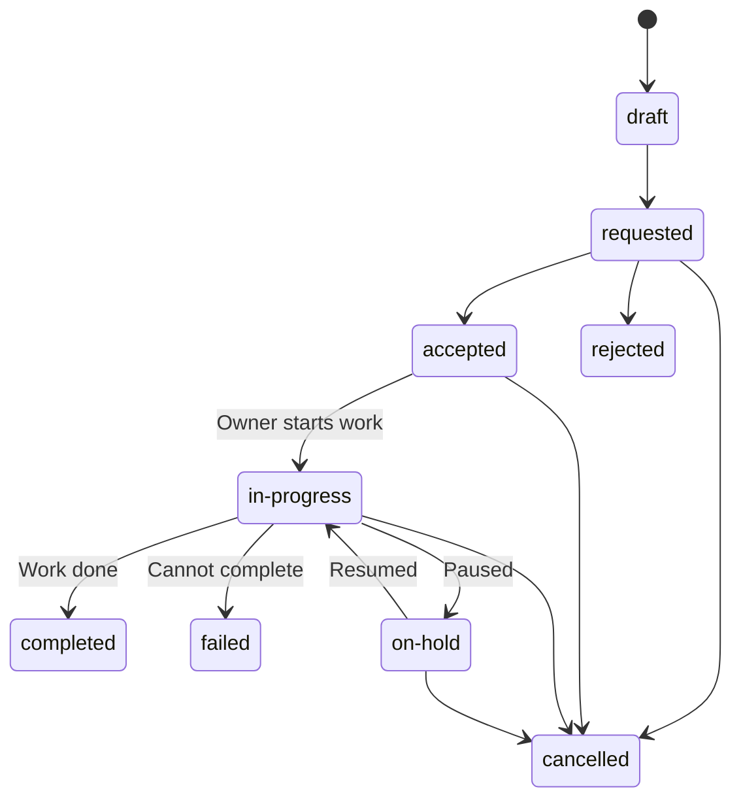
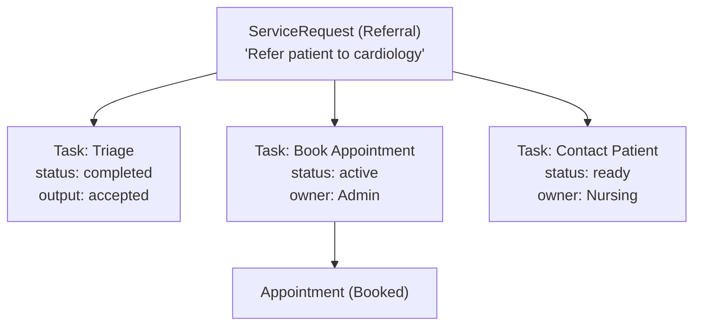
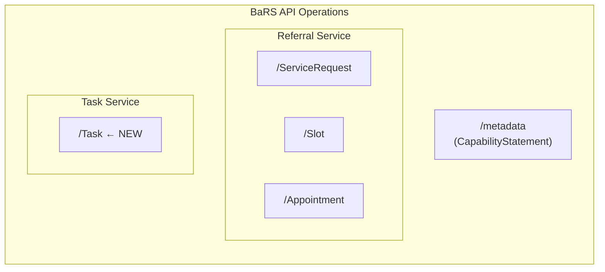
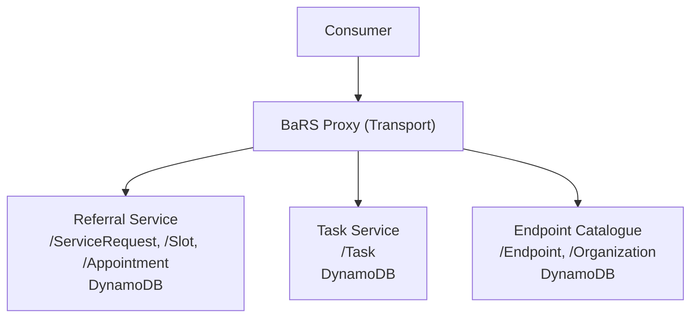

# Adding Tasking to the BaRS API via FHIR Task

## Purpose

This document describes how the FHIR R4 `Task` resource can be introduced to the BaRS API to support tasking workflows — enabling systems to request, track, and complete discrete units of work associated with referrals, bookings, and other BaRS interactions.

Tasking fills a gap in the current BaRS model: while `ServiceRequest` captures *what* needs to happen for a patient (the clinical intent) and `Appointment` captures *when* it will happen, neither tracks the operational *work items* that need to be performed by people or systems to fulfil those requests.

---

## What Is FHIR Task?

The FHIR R4 [Task](https://www.hl7.org/fhir/R4/task.html) resource represents an activity that can be performed, and tracks the state of completion of that activity. It is the standard FHIR mechanism for:

- Requesting that work be done
- Assigning work to a performer (person, team, or system)
- Tracking progress through a defined state machine
- Recording inputs needed and outputs produced
- Linking work items to the clinical requests they fulfil

### Task vs ServiceRequest vs Appointment

| Resource | Represents | Example |
|---|---|---|
| **ServiceRequest** | Clinical intent — *what* should happen for the patient | "Refer this patient to cardiology" |
| **Appointment** | Scheduled event — *when* it will happen | "Patient booked for 14:30 on Tuesday" |
| **Task** | Operational work item — *who* needs to do *what* to make it happen | "Triage this referral", "Review attachment", "Book an appointment for this patient" |

Tasks exist **alongside** ServiceRequests and Appointments — they don't replace them. A single ServiceRequest may generate multiple Tasks (triage, book, review, follow-up).

---

## Use Cases for Tasking in BaRS

### 1. Triage a Referral

A referral arrives at a provider service. A task is created for a clinician to triage it — review the clinical information, decide whether to accept, reject, redirect, or request more information.

```
ServiceRequest (referral) → Task (triage this referral)
                                 owner: Cardiology Triage Team
                                 status: requested → accepted → in-progress → completed
                                 output: triage decision (accept/reject/redirect)
```

### 2. Book an Appointment for a Patient

After triage acceptance, a task is created for admin staff (or an automated system) to book the patient into a slot.

```
ServiceRequest (referral) → Task (book appointment)
                                 owner: Booking Admin Team
                                 status: requested → in-progress → completed
                                 output: Reference to created Appointment
```

### 3. Review Clinical Attachments

A referral arrives with attachments (letters, images, test results). A task is created for a clinician to review the supporting documentation before making a triage decision.

```
ServiceRequest (referral) → Task (review attachments)
                                 input: DocumentReference(s) to review
                                 owner: Specialist Clinician
                                 status: requested → in-progress → completed
```

### 4. Request Additional Information

During triage, the provider determines they need more information from the referrer. A task is created and assigned back to the referring organisation.

```
ServiceRequest (referral) → Task (provide additional information)
                                 requester: Provider Org
                                 owner: Referring GP Practice
                                 status: requested → in-progress → completed
                                 output: Additional clinical information
```

### 5. Patient Contact / Pre-Assessment

A task for admin or nursing staff to contact the patient (e.g., pre-assessment questionnaire, confirm attendance, provide instructions).

```
ServiceRequest (referral) → Task (contact patient for pre-assessment)
                                 owner: Pre-Assessment Nursing Team
                                 for: Patient
                                 status: requested → in-progress → completed
```

### 6. Follow-Up After Appointment

After a patient attends, a task for follow-up actions (send outcome letter to GP, schedule follow-up appointment, discharge).

```
Appointment (completed) → Task (send outcome to referrer)
                               owner: Admin Team
                               status: requested → completed
```

### 7. Wayfinder / Patient-Facing Tasks

Tasks that are visible to or actionable by the patient via the NHS App / Wayfinder:

- "Complete this pre-appointment questionnaire"
- "Confirm you can attend your appointment"
- "Upload a photo of your condition"

```
Task (complete questionnaire)
    for: Patient
    owner: Patient
    status: requested → in-progress → completed
    input: Questionnaire reference
    output: QuestionnaireResponse reference
```

---

## API Operations

The following FHIR R4 RESTful operations would be added to the BaRS API:

| Operation | HTTP | Path | Purpose |
|-----------|------|------|---------|
| **Search** | `GET` | `/Task` | Find tasks by owner, requester, patient, status, focus |
| **Read** | `GET` | `/Task/{id}` | Retrieve a single task |
| **Create** | `POST` | `/Task` | Create a new task (assign work) |
| **Update** | `PUT` | `/Task/{id}` | Full update (e.g. reassignment) |
| **Patch** | `PATCH` | `/Task/{id}` | Status transitions, partial updates |

### Search Parameters

| Parameter | Type | Description | Example |
|---|---|---|---|
| `_id` | token | Task resource ID | `_id=abc123` |
| `owner` | reference | Who is responsible for the task | `owner:identifier=https://fhir.nhs.uk/Id/ods-organization-code\|R69` |
| `requester` | reference | Who requested the task | `requester:identifier=...` |
| `patient` | reference | The patient the task relates to | `patient:identifier=https://fhir.nhs.uk/Id/nhs-number\|9876543210` |
| `status` | token | Current task status | `status=requested,accepted,in-progress` |
| `focus` | reference | The resource the task acts on | `focus=ServiceRequest/000000070000` |
| `code` | token | Type of task | `code=triage` |
| `priority` | token | Task priority | `priority=urgent` |
| `authored-on` | date | When the task was created | `authored-on=ge2025-06-01` |
| `modified` | date | When the task was last updated | `modified=ge2025-06-15` |
| `business-status` | token | Domain-specific sub-status | `business-status=awaiting-clinician` |
| `_sort` | special | Sort order | `_sort=-modified` |
| `_count` | number | Page size | `_count=50` |

---

## Task State Machine

BaRS adopts the standard FHIR Task state machine:



### Status Transitions

| From | To | Trigger | Example |
|---|---|---|---|
| `draft` | `requested` | Task is ready to be actioned | Triage task sent to provider |
| `requested` | `accepted` | Owner acknowledges the task | Clinician accepts triage assignment |
| `requested` | `rejected` | Owner declines the task | Task reassigned to another team |
| `accepted` | `in-progress` | Owner starts work | Clinician begins reviewing referral |
| `in-progress` | `completed` | Work is done | Triage decision recorded |
| `in-progress` | `failed` | Cannot complete | Missing information prevents triage |
| `in-progress` | `on-hold` | Paused (awaiting something) | Waiting for additional info from referrer |
| `on-hold` | `in-progress` | Resumed | Additional info received |
| Any non-terminal | `cancelled` | Task no longer needed | Referral cancelled, so triage task cancelled |

### Business Status (Sub-States)

The `businessStatus` field carries domain-specific detail beyond the FHIR status:

| Task Type | businessStatus Values |
|---|---|
| **Triage** | `awaiting-clinician`, `under-review`, `decision-recorded`, `awaiting-additional-info` |
| **Booking** | `searching-slots`, `slot-reserved`, `patient-contacted`, `booking-confirmed` |
| **Patient Contact** | `voicemail-left`, `patient-reached`, `no-response`, `letter-sent` |
| **Review Attachments** | `attachments-received`, `review-in-progress`, `review-complete` |

---

## Task Resource Structure

### Example: Triage Task

```json
{
  "resourceType": "Task",
  "id": "task-triage-001",
  "meta": {
    "versionId": "3",
    "lastUpdated": "2025-06-16T10:30:00+01:00",
    "profile": [
      "https://fhir.nhs.uk/StructureDefinition/BaRS-Task"
    ]
  },
  "status": "in-progress",
  "businessStatus": {
    "coding": [
      {
        "system": "https://fhir.nhs.uk/CodeSystem/bars-task-business-status",
        "code": "under-review",
        "display": "Under Review"
      }
    ]
  },
  "intent": "order",
  "priority": "routine",
  "code": {
    "coding": [
      {
        "system": "https://fhir.nhs.uk/CodeSystem/bars-task-code",
        "code": "triage-referral",
        "display": "Triage Referral"
      }
    ]
  },
  "description": "Triage incoming cardiology referral - review clinical information and decide on acceptance",
  "focus": {
    "reference": "ServiceRequest/000000070000",
    "identifier": {
      "system": "https://fhir.nhs.uk/Id/UBRN",
      "value": "000000070000"
    },
    "display": "Cardiology referral for John Smith"
  },
  "for": {
    "identifier": {
      "system": "https://fhir.nhs.uk/Id/nhs-number",
      "value": "9876543210"
    },
    "display": "John Smith"
  },
  "authoredOn": "2025-06-15T09:00:00+01:00",
  "lastModified": "2025-06-16T10:30:00+01:00",
  "requester": {
    "identifier": {
      "system": "https://fhir.nhs.uk/Id/ods-organization-code",
      "value": "A1001"
    },
    "display": "Anytown GP Practice"
  },
  "owner": {
    "identifier": {
      "system": "https://fhir.nhs.uk/Id/ods-organization-code",
      "value": "R69"
    },
    "display": "Anytown General Hospital - Cardiology Triage"
  },
  "restriction": {
    "period": {
      "end": "2025-06-22T23:59:59+01:00"
    }
  },
  "input": [
    {
      "type": {
        "coding": [
          {
            "system": "https://fhir.nhs.uk/CodeSystem/bars-task-input-type",
            "code": "referral-letter",
            "display": "Referral Letter"
          }
        ]
      },
      "valueReference": {
        "reference": "DocumentReference/doc-001"
      }
    },
    {
      "type": {
        "coding": [
          {
            "system": "https://fhir.nhs.uk/CodeSystem/bars-task-input-type",
            "code": "clinical-information",
            "display": "Clinical Information"
          }
        ]
      },
      "valueString": "Patient presenting with intermittent chest pain on exertion. ECG normal."
    }
  ]
}
```

### Example: Completed Triage Task (with output)

```json
{
  "resourceType": "Task",
  "id": "task-triage-001",
  "status": "completed",
  "businessStatus": {
    "coding": [
      {
        "system": "https://fhir.nhs.uk/CodeSystem/bars-task-business-status",
        "code": "decision-recorded",
        "display": "Decision Recorded"
      }
    ]
  },
  "intent": "order",
  "code": {
    "coding": [
      {
        "system": "https://fhir.nhs.uk/CodeSystem/bars-task-code",
        "code": "triage-referral",
        "display": "Triage Referral"
      }
    ]
  },
  "focus": {
    "reference": "ServiceRequest/000000070000"
  },
  "for": {
    "identifier": {
      "system": "https://fhir.nhs.uk/Id/nhs-number",
      "value": "9876543210"
    }
  },
  "authoredOn": "2025-06-15T09:00:00+01:00",
  "lastModified": "2025-06-16T11:45:00+01:00",
  "output": [
    {
      "type": {
        "coding": [
          {
            "system": "https://fhir.nhs.uk/CodeSystem/bars-task-output-type",
            "code": "triage-decision",
            "display": "Triage Decision"
          }
        ]
      },
      "valueCodeableConcept": {
        "coding": [
          {
            "system": "https://fhir.nhs.uk/CodeSystem/bars-triage-outcome",
            "code": "accepted",
            "display": "Accepted - Book appointment"
          }
        ]
      }
    },
    {
      "type": {
        "coding": [
          {
            "system": "https://fhir.nhs.uk/CodeSystem/bars-task-output-type",
            "code": "triage-note",
            "display": "Triage Note"
          }
        ]
      },
      "valueString": "Appropriate referral. Please book into next available cardiology outpatient slot."
    }
  ]
}
```

---

## Task Code System

A BaRS-specific code system defines the types of tasks that can be created:

| Code | Display | Description | Typical Owner |
|---|---|---|---|
| `triage-referral` | Triage Referral | Review and make a triage decision on a referral | Provider clinician |
| `book-appointment` | Book Appointment | Book a patient into an available slot | Admin staff or system |
| `review-attachments` | Review Attachments | Review clinical documentation attached to a referral | Provider clinician |
| `request-information` | Request Additional Information | Ask the referrer for more clinical detail | Referring organisation |
| `contact-patient` | Contact Patient | Contact the patient (pre-assessment, confirm attendance) | Admin/nursing staff |
| `complete-questionnaire` | Complete Questionnaire | Patient to complete a pre-appointment questionnaire | Patient |
| `send-outcome` | Send Outcome | Send appointment outcome/letter back to referrer | Admin staff |
| `schedule-follow-up` | Schedule Follow-Up | Arrange a follow-up appointment or review | Admin staff |
| `discharge` | Discharge from Pathway | Complete the referral pathway and discharge the patient | Clinician |
| `redirect-referral` | Redirect Referral | Redirect a referral to a different service | Triage clinician |
| `cancel-appointment` | Cancel Appointment | Cancel an existing booking | Admin staff or patient |
| `escalate` | Escalate | Escalate to a senior clinician or manager | Current owner |

---

## How Tasks Relate to Existing BaRS Resources



### Linking Tasks

| Relationship | FHIR Field | Meaning |
|---|---|---|
| Task → ServiceRequest | `Task.focus` | The referral this task is working to fulfil |
| Task → Patient | `Task.for` | The patient the task relates to |
| Task → Appointment | `Task.output` | The appointment created as a result of a booking task |
| Task → Task (parent) | `Task.partOf` | Sub-tasks within a larger workflow |
| Task → ServiceRequest | `Task.basedOn` | Higher-level authorisation that triggered this task |
| Task → Organization | `Task.owner` | Who is responsible for completing the task |
| Task → Organization | `Task.requester` | Who created/requested the task |

---

## Workflow Examples

### Workflow 1: Standard Referral with Triage

```
Step 1: Referrer creates ServiceRequest (referral)
        POST /ServiceRequest → creates referral for patient

Step 2: System auto-creates triage Task
        POST /Task
        {
          status: "requested",
          code: "triage-referral",
          focus: ServiceRequest/{id},
          owner: Provider Triage Team
        }

Step 3: Triage clinician accepts the task
        PATCH /Task/{id}
        [{ "op": "replace", "path": "/status", "value": "accepted" }]

Step 4: Triage clinician starts review
        PATCH /Task/{id}
        [{ "op": "replace", "path": "/status", "value": "in-progress" }]

Step 5: Triage clinician completes review — accepts referral
        PATCH /Task/{id}
        [
          { "op": "replace", "path": "/status", "value": "completed" },
          { "op": "add", "path": "/output/-", "value": { triage-decision: "accepted" } }
        ]

Step 6: System auto-creates booking Task
        POST /Task
        {
          status: "requested",
          code: "book-appointment",
          focus: ServiceRequest/{id},
          owner: Booking Admin
        }

Step 7: Admin books appointment
        POST /Appointment (books the slot)
        PATCH /Task/{id}
        [
          { "op": "replace", "path": "/status", "value": "completed" },
          { "op": "add", "path": "/output/-", "value": { appointment: "Appointment/{appt-id}" } }
        ]
```

### Workflow 2: Triage Rejection with Redirect

```
Step 1: Triage task in-progress
Step 2: Clinician decides to reject and redirect to a different service

        PATCH /Task/{id}  (triage task)
        [
          { "op": "replace", "path": "/status", "value": "completed" },
          { "op": "add", "path": "/output/-", "value": { triage-decision: "redirect" } }
        ]

Step 3: System creates redirect Task
        POST /Task
        {
          status: "requested",
          code: "redirect-referral",
          focus: ServiceRequest/{id},
          owner: Original Referrer (or new service)
        }
```

### Workflow 3: Patient-Facing Task (Questionnaire)

```
Step 1: After triage acceptance, system creates patient task
        POST /Task
        {
          status: "requested",
          code: "complete-questionnaire",
          focus: ServiceRequest/{id},
          for: Patient (NHS Number),
          owner: Patient,
          input: [{ type: "questionnaire", value: Questionnaire/pre-cardiology }]
        }

Step 2: Patient receives notification via NHS App / Wayfinder
        (Task appears in patient's task list)

Step 3: Patient completes questionnaire
        POST /QuestionnaireResponse (patient submits answers)
        PATCH /Task/{id}
        [
          { "op": "replace", "path": "/status", "value": "completed" },
          { "op": "add", "path": "/output/-", "value": { response: "QuestionnaireResponse/{id}" } }
        ]
```

---

## Automatic Task Creation (Task Orchestration)

Tasks can be created manually (by a user action) or automatically (by rules triggered on events). The BaRS Referral Service can implement orchestration rules:

| Trigger Event | Auto-Created Task | Owner |
|---|---|---|
| New ServiceRequest received by a provider | `triage-referral` | Provider triage team |
| Triage completed with "accepted" outcome | `book-appointment` | Provider admin |
| Appointment booked | `contact-patient` (if pre-assessment needed) | Nursing team |
| Appointment completed | `send-outcome` | Admin |
| Triage completed with "redirect" | `redirect-referral` | Original referrer or new service |
| Referral has attachments | `review-attachments` | Provider clinician |
| Booking confirmed | `complete-questionnaire` (if applicable) | Patient |

These rules can be configured per service/use-case and are not hard-coded. The orchestration logic sits within the Referral Service (not in BaRS Proxy, which remains stateless transport).

---

## Task Notifications

Tasks are most useful when owners are notified promptly. Two notification mechanisms are supported:

### Polling (Near-Term)

Task owners poll for tasks assigned to them:

```http
GET /Task?owner:identifier=https://fhir.nhs.uk/Id/ods-organization-code|R69
    &status=requested,accepted,in-progress
    &_sort=-modified
    &_count=50 HTTP/1.1
```

This returns all active tasks for the organisation, sorted by most recently modified. The `meta.versionId` on each Task enables efficient change detection (only process tasks whose version has changed since last poll).

### Push via Multicast Notification Service (Strategic)

When a Task is created or its status changes, an event is published to the [Multicast Notification Service (MNS)](https://digital.nhs.uk/developer/api-catalogue/multicast-notification-service):

```json
{
  "type": "Task",
  "event": "created",
  "resourceId": "task-triage-001",
  "focus": "ServiceRequest/000000070000",
  "owner": "https://fhir.nhs.uk/Id/ods-organization-code|R69",
  "status": "requested",
  "priority": "routine"
}
```

Subscribing systems receive the notification and can then fetch the full Task resource via `GET /Task/{id}`.

### Patient Notifications (NHS App / Wayfinder)

For patient-owned tasks (`owner` = Patient), notifications are surfaced through the NHS App:

- "You have a new task: Complete your pre-appointment questionnaire"
- "Reminder: Please confirm your attendance for your cardiology appointment"

The Wayfinder / Patient Care Aggregator can query for patient tasks:

```http
GET /Task?patient:identifier=https://fhir.nhs.uk/Id/nhs-number|9876543210
    &owner:identifier=https://fhir.nhs.uk/Id/nhs-number|9876543210
    &status=requested,accepted,in-progress HTTP/1.1
```

---

## Task Deadlines and SLAs

The `Task.restriction.period` field defines the window within which the task should be completed. This enables:

- **SLA monitoring:** Track tasks approaching or exceeding their deadline
- **Escalation:** Auto-create escalation tasks when deadlines are missed
- **Reporting:** Measure time-to-triage, time-to-book, etc.

### Example Deadline Query

Find overdue tasks:

```http
GET /Task?owner:identifier=...&status=requested,accepted,in-progress
    &restriction-period=le2025-06-16T00:00:00+01:00 HTTP/1.1
```

### Escalation Pattern

```
1. Task created with restriction.period.end = 7 days from now
2. If task not completed by deadline:
   - Auto-create escalation Task (code: "escalate")
   - Assign to manager/senior clinician
   - Reference the overdue task via Task.partOf
```

---

## Profile: BaRS-Task

A UK Core-aligned profile constraining the FHIR Task resource for BaRS use:

| Element | Cardinality | Constraint |
|---|---|---|
| `Task.status` | 1..1 | Required (standard FHIR TaskStatus) |
| `Task.intent` | 1..1 | Fixed to `order` for most BaRS tasks |
| `Task.code` | 1..1 | **Required** — must use `bars-task-code` system |
| `Task.focus` | 1..1 | **Required** — must reference the ServiceRequest or Appointment |
| `Task.for` | 1..1 | **Required** — must identify the patient (NHS Number) |
| `Task.authoredOn` | 1..1 | Required |
| `Task.requester` | 1..1 | Required — who created the task |
| `Task.owner` | 0..1 | Required when status ≥ `requested` |
| `Task.restriction.period` | 0..1 | Recommended — deadline for completion |
| `Task.businessStatus` | 0..1 | Recommended — domain-specific sub-state |
| `Task.input` | 0..* | Optional — information needed to complete the task |
| `Task.output` | 0..* | Required when status = `completed` — results of the task |

---

## Integration with BaRS Standard Pattern

### Where Task Fits in the BaRS API Surface



### Headers and Auth

Task operations use the same BaRS standard headers and authentication as all other operations:

| Header | Purpose |
|---|---|
| `Authorization` | Bearer JWT (app-restricted) |
| `X-Request-Id` | Unique request identifier |
| `X-Correlation-Id` | Correlation across related requests |
| `NHSD-End-User-Organisation` | Calling organisation identity |
| `NHSD-Target-Identifier` | Target service (for Proxy routing) |

### Task in CapabilityStatement

The receiver's `GET /metadata` response must declare Task support:

```json
{
  "resource": [
    {
      "type": "Task",
      "interaction": [
        {"code": "search-type"},
        {"code": "read"},
        {"code": "create"},
        {"code": "update"},
        {"code": "patch"}
      ],
      "searchParam": [
        {"name": "owner", "type": "reference"},
        {"name": "status", "type": "token"},
        {"name": "focus", "type": "reference"},
        {"name": "patient", "type": "reference"},
        {"name": "code", "type": "token"}
      ]
    }
  ]
}
```

---

## Task Service Architecture

Tasks are managed by a **dedicated Task Service** — a discrete, independently deployable microservice, architecturally similar to the Endpoint Catalogue (EPC). It owns its own data store, exposes FHIR R4 operations via the BaRS Proxy, and has no direct dependency on the Referral Service or e-RS.

For full architectural detail (data store design, component breakdown, event integration, observability, DR, and deployment), see the dedicated **[Task Service Architecture](./task-service-architecture.md)** document.

### Summary



Key characteristics:
- **Independent scaling, deployment, and ownership** — same operational model as EPC
- **DynamoDB storage** — FHIR Task JSON stored as documents with GSIs for owner, patient, focus, and status queries
- **Event-driven** — consumes events from the Referral Service to auto-create tasks; publishes task lifecycle events to MNS for subscribers
- **Reusable** — supports tasking for any BaRS use case, not coupled to referrals specifically

---

## Relationship to Wayfinder

The Wayfinder specification (Patient Care Aggregator) already surfaces referral and appointment data from provider systems to the NHS App. Adding Task support enables:

| Wayfinder Capability | Enabled by Task |
|---|---|
| "You have a new referral — awaiting triage" | Task (code: `triage-referral`, status visible to patient as "being reviewed") |
| "Please complete this questionnaire before your appointment" | Task (code: `complete-questionnaire`, owner: Patient) |
| "Your referral has been accepted — appointment to be booked" | Task (code: `book-appointment`, patient can see progress) |
| "Please confirm you can attend on Tuesday" | Task (code: `contact-patient`, owner: Patient) |
| "Your appointment outcome has been sent to your GP" | Task (code: `send-outcome`, status: completed) |

This gives patients visibility into the operational progress of their referral — not just "you have a referral" and "you have an appointment", but the steps in between.

---

## Migration and Adoption

| Phase | Capability | Impact |
|---|---|---|
| **1 — Internal tasking** | Provider systems create and manage tasks internally (not shared via BaRS) | No API change; proves the model locally |
| **2 — Task via BaRS API** | `POST /Task` and `GET /Task` added to BaRS API; tasks visible across org boundaries | Enables cross-org tasking (e.g., "provide more info" back to referrer) |
| **3 — Auto-creation rules** | Referral Service auto-creates tasks on ServiceRequest events | Reduces manual task creation; standardises workflows |
| **4 — Patient-facing tasks** | Patient-owned tasks surfaced via Wayfinder / NHS App | Patients see and action their tasks |
| **5 — SLA and reporting** | Deadline monitoring, escalation, task analytics | Operational intelligence on referral pathway performance |

---

## Summary

Adding `Task` to the BaRS API provides:

- **Operational visibility** — track discrete work items across the referral pathway
- **Cross-organisational tasking** — request work from other organisations (e.g., "send more info") via a standard interface
- **Patient engagement** — surface actionable tasks to patients via Wayfinder / NHS App
- **Workflow automation** — auto-create tasks on events, monitor deadlines, escalate overdue items
- **Standard FHIR** — uses the R4 Task resource and its well-defined state machine; no custom operations needed
- **Composable** — tasks link to ServiceRequests, Appointments, DocumentReferences, and Questionnaires via standard FHIR references

The Task resource fills the gap between "what should happen" (ServiceRequest) and "when it will happen" (Appointment) — it tracks the *work* required to get from one to the other.
