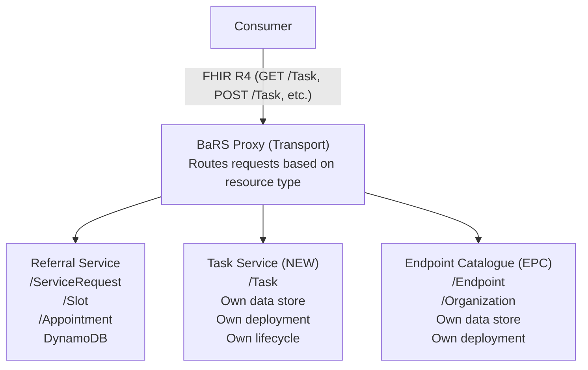
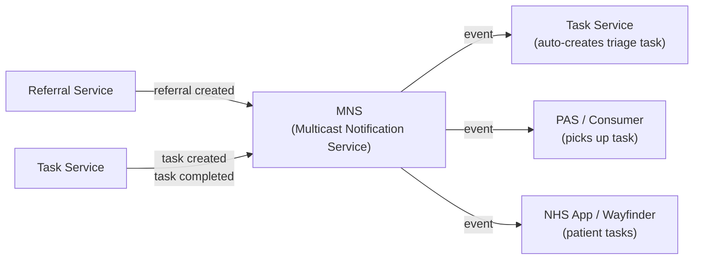

# Task Service Architecture

## Purpose

This document describes the architecture of the **Task Service** — a discrete, independently deployable microservice that manages FHIR R4 Task resources for the BaRS ecosystem. It is architecturally similar to the Endpoint Catalogue (EPC): it owns its own data store, exposes FHIR R4 operations via the BaRS Proxy, and has no direct dependency on the Referral Service or e-RS.

For the functional design of tasking (use cases, state machine, workflows, code systems), see [bars-tasking-fhir-task.md](./bars-tasking-fhir-task.md).

---

## Architecture Overview



---

## Why a Separate Service (Like EPC)

| Reason | Detail |
|---|---|
| **Independent scaling** | Task query volume will be high (every org polls for their task queue); needs to scale independently of referral reads/writes |
| **Independent deployment** | Task Service can be updated, patched, and deployed without affecting referral or booking flows |
| **Clear ownership** | Single team owns the Task Service end-to-end (build, run, support) — same model as EPC |
| **Different access patterns** | Tasks are queried by owner (org worklist), patient (NHS App), and focus (referral). These patterns differ from ServiceRequest query patterns and benefit from dedicated indexes |
| **Simpler blast radius** | A Task Service outage doesn't affect the ability to create referrals or book appointments |
| **Reusable beyond referrals** | The Task Service can support tasks for other BaRS use cases (e.g., 111-to-ED handover tasks, A&G response tasks) without coupling to the Referral Service |

---

## Comparison with EPC

| Aspect | Task Service | Endpoint Catalogue (EPC) |
|---|---|---|
| **Purpose** | Store and serve FHIR Task resources | Store and serve endpoint/service metadata |
| **Data model** | FHIR R4 Task (JSON documents) | Endpoint, Organization, HealthcareService |
| **Storage** | DynamoDB | DynamoDB |
| **API style** | FHIR R4 RESTful (search, read, create, update, patch) | FHIR R4 RESTful (search, read, create, update) |
| **Auth** | App-restricted (signed JWT) | App-restricted (signed JWT) + CIS2 for admin |
| **Infrastructure** | AWS Lambda or ECS Fargate, API Gateway, DynamoDB | AWS Lambda, API Gateway, DynamoDB |
| **Observability** | CloudWatch / ODIN (same patterns as EPC) | CloudWatch / ODIN |
| **Deployment** | Terraform, CI/CD pipeline | Terraform, CI/CD pipeline |
| **Proxy integration** | BaRS Proxy routes `/Task` requests to this service | BaRS Proxy routes service discovery requests to EPC |

---

## Data Store Design

The Task Service uses DynamoDB with the following table and index design:

### Primary Table: `bars-tasks`

| Attribute | Type | Role |
|---|---|---|
| `id` | String (UUID) | Partition key |
| `version` | Number | Sort key (for version history) |
| `resource` | JSON | Full FHIR Task resource |
| `owner_ods` | String | Extracted for GSI |
| `patient_nhs_number` | String | Extracted for GSI |
| `focus_id` | String | Extracted for GSI |
| `status` | String | Extracted for GSI |
| `last_modified` | String (ISO 8601) | Extracted for GSI |
| `authored_on` | String (ISO 8601) | Extracted for GSI |
| `code` | String | Extracted for GSI |

### Global Secondary Indexes

| GSI | Partition Key | Sort Key | Purpose |
|---|---|---|---|
| **task-by-owner-status** | `owner_ods` | `last_modified` (DESC) | Org task queue — "show me my active tasks" |
| **task-by-patient** | `patient_nhs_number` | `last_modified` (DESC) | Patient's task list (NHS App / Wayfinder) |
| **task-by-focus** | `focus_id` | `authored_on` | All tasks for a given referral |
| **task-by-owner-code** | `owner_ods` + `code` (composite) | `last_modified` (DESC) | Filtered task queue — "show me triage tasks" |

### Storage Characteristics

| Aspect | Detail |
|---|---|
| **Capacity mode** | On-demand (auto-scaling) — task volume is unpredictable during early adoption |
| **Item size** | ~2–5 KB per task (FHIR JSON + extracted attributes) |
| **Versioning** | Previous versions retained (version as sort key) — supports audit and history |
| **TTL** | Completed/cancelled tasks retained for 365 days, then archived to S3 |
| **Encryption** | AWS KMS (encrypted at rest); TLS in transit |
| **Backup** | Point-in-time recovery (PITR) enabled; on-demand backup before deployments |

---

## Service Components

```
task-service/
├── api/
│   ├── routes/
│   │   ├── search-task.ts          # GET /Task (search)
│   │   ├── read-task.ts            # GET /Task/{id}
│   │   ├── create-task.ts          # POST /Task
│   │   ├── update-task.ts          # PUT /Task/{id}
│   │   └── patch-task.ts           # PATCH /Task/{id} (status transitions)
│   ├── middleware/
│   │   ├── auth-validator.ts       # JWT validation
│   │   ├── org-scope-enforcer.ts   # Only see tasks you own or requested
│   │   └── audit-logger.ts         # Audit trail
│   └── validators/
│       ├── task-profile-validator.ts  # BaRS-Task profile validation
│       └── state-machine.ts           # Enforce valid status transitions
├── domain/
│   ├── task-state-machine.ts       # Valid transitions + business rules
│   ├── orchestration-rules.ts     # Auto-create tasks on events
│   └── deadline-monitor.ts        # Check for overdue tasks
├── events/
│   ├── task-event-publisher.ts    # Publish to MNS on task create/update
│   └── referral-event-consumer.ts # Listen for ServiceRequest events → auto-create tasks
├── persistence/
│   ├── dynamo-repository.ts       # DynamoDB read/write
│   └── index-extractor.ts        # Extract GSI attributes from FHIR JSON
└── config/
    ├── task-codes.json            # Supported task types
    ├── business-statuses.json     # Valid business statuses per task type
    └── orchestration-rules.json   # Event → task creation rules
```

---

## Event Integration

The Task Service both **produces** and **consumes** events via the Multicast Notification Service (MNS):

### Produces (publishes to MNS)

| Event | Trigger | Subscribers |
|---|---|---|
| `task.created` | New task assigned | PAS, NHS App, workflow monitors |
| `task.status-changed` | Task status transitioned | Task owner, requester, patient |
| `task.completed` | Task finished (with output) | Downstream orchestration, reporting |
| `task.overdue` | Task passed its deadline | Escalation handlers, management dashboards |

### Consumes (subscribes from other services)

| Event Source | Event | Action |
|---|---|---|
| Referral Service | `servicerequest.created` | Auto-create triage task |
| Referral Service | `servicerequest.status-changed` | Auto-create follow-up tasks |
| Referral Service | `appointment.booked` | Auto-create pre-assessment task |
| Referral Service | `appointment.completed` | Auto-create outcome/discharge tasks |

### Event Flow Diagram



---

## Authorisation Model

| Check | Mechanism | Detail |
|---|---|---|
| **Caller identity** | Signed JWT (app-restricted) | BaRS Proxy validates token |
| **Task visibility** | Org-scoped filtering | Consumers can only see tasks where they are the `owner` or `requester` |
| **Patient access** | NHS Login / CIS2 (user-restricted) | Patients see only their own tasks (where `for` = their NHS Number and `owner` = their NHS Number) |
| **Write access** | Owner or requester only | Only the task owner can transition status; only the requester can cancel |
| **Admin override** | CIS2 with elevated role | For support/operational scenarios |

---

## Observability

Following the same pattern as EPC:

| Metric | CloudWatch Alarm | Threshold |
|---|---|---|
| API 5XX rate | `task-service-5xx-rate` | > 1% over 5 minutes |
| API 4XX rate | `task-service-4xx-rate` | > 10% over 5 minutes |
| P95 latency (search) | `task-service-search-latency-p95` | > 500ms |
| P95 latency (read) | `task-service-read-latency-p95` | > 100ms |
| DynamoDB throttling | `task-service-dynamo-throttle` | > 0 |
| Task creation rate | `task-service-create-rate` | Anomaly detection |
| Overdue task count | `task-service-overdue-count` | > configured threshold per org |

### Dashboards

- **Operational dashboard** — request rates, latency, error rates, DynamoDB metrics
- **Task analytics dashboard** — tasks created/completed per day, average time-to-complete by task type, overdue rate
- **Per-org dashboard** — task queue depth, SLA compliance, escalation rate

---

## Disaster Recovery

| Aspect | Detail |
|---|---|
| **RPO** | < 5 minutes (DynamoDB PITR) |
| **RTO** | < 30 minutes (Terraform redeploy + PITR restore) |
| **Multi-region** | Not initially — single-region with PITR; multi-region if classified as Gold |
| **Backup** | PITR continuous + on-demand before each deployment |
| **Rollback** | Lambda alias swap or ECS task definition rollback |

---

## Deployment and CI/CD

| Stage | Environment | Purpose |
|---|---|---|
| **Dev** | Developer sandbox | Local development and unit tests |
| **INT** | Integration | Integration testing with BaRS Proxy and Referral Service |
| **Staging** | Pre-production | Performance testing, load testing, full end-to-end flows |
| **Production** | Live | Serving real traffic |

Promotion between environments is manual (approval gate) — same model as EPC.

---

## Open Questions

| # | Question | Impact | Owner |
|---|---|---|---|
| 1 | Should the Task Service be Lambda-based (like EPC) or containerised (ECS Fargate)? | Cost, latency, connection patterns | Architecture |
| 2 | What is the expected task volume at steady state? (Tasks per day, peak QPS) | Capacity planning, DynamoDB mode | Product |
| 3 | Should orchestration rules live in the Task Service or in a separate orchestration engine? | Complexity, coupling | Architecture |
| 4 | How are patient-facing tasks surfaced to Wayfinder? (Direct query to Task Service, or via Patient Care Aggregator?) | Integration pattern | Wayfinder team |
| 5 | What is the SLA for task notifications? (How quickly must a new task be visible to the owner?) | MNS latency requirements | Product |
| 6 | Should completed tasks be archived to S3/Athena for long-term reporting, or kept in DynamoDB with TTL? | Cost, query patterns for analytics | Architecture |
| 7 | Who operates the Task Service? (Same team as EPC? Dedicated team?) | Staffing, on-call | Delivery |
